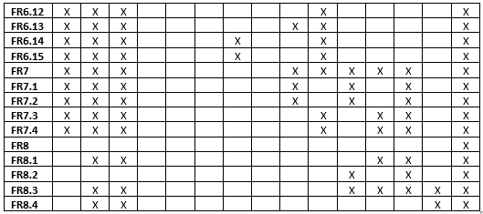
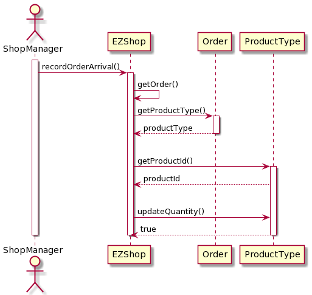
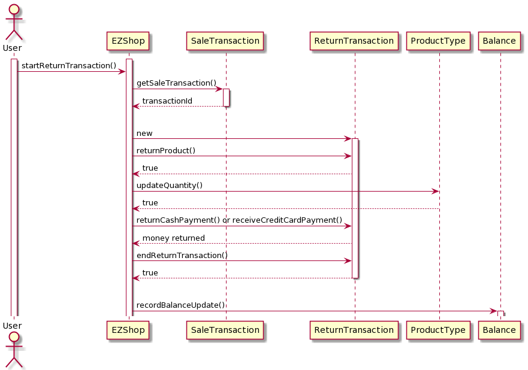

# Design Document 

Authors: Marco Sapio, Marta Caggiano, Emma Marrocu, Francesco Rabezzano

Date: April 2021

Version: 1.0.0

# Contents

- [High level design](#package-diagram)
- [Low level design](#class-diagram)
- [Verification traceability matrix](#verification-traceability-matrix)
- [Verification sequence diagrams](#verification-sequence-diagrams)

# High level design 

# Low level design

``` plantuml 
@startuml
class EZShop{
 runningUser: User
 returnTransaction: ReturnTransaction
 saleTransaction: SaleTransaction
 saleTransaction_state: boolean 
 returnTransaction_state: boolean 
 reset(): void
 createUser(username:String, password:String,role:String): Integer
 deleteUser(id:Integer): boolean
 getAllUsers(): List<User>
 getUser(id:Integer): User
 updateUserRights(id:Integer, role:String): boolean
 login(username:String, password:String): User
 logout(): boolean
 createProductType(description:String, productCode:String, pricePerUnit:double, note:String): Integer
 updateProduct(id:Integer, newDescription:String, newCode:String, newPrice:String, newNote:String): boolean
 deleteProductType(id:Integer): boolean
 getAllProductTypes(): List<ProductType>
 getProductTypeBarCode(barCode:String): ProductType
 getProductTypesByDescription(description:String): List<ProductType>
 updateQuantity(productId:Integer, toBeAdded:int): boolen
 updatePosition(productId:Integer, newPos:String): boolean
 issueOrder(productCode:String, quantity:int, pricePerUnit:double): Integer
 payOrderFor(productCode:String, quantity:int, pricePerUnit:double): Integer
 payOrder(orderId:Integer): boolean
 recordOrderArrival(orderId:Integer): boolean
 getAllOrders(): List<Order>
 getOrder(): Order
 defineCustomer(customerName:String): Integer
 modifyCustomer(id:Integer, newCustomerName:String, newCustomerCard:String): boolean
 deleteCustomer(id:Integer): boolean
 getCustomer(id:Integer): Customer
 getAllCustomers(): List<Customers>
 createCard(): String
 attachCardToCustomer(customerCard:String, customerId:String): boolean
 modifyPointsOnCard(customerCard:String, pointsToBeAdded:int): boolean
 startSaleTransaction(): Integer
 applyDiscountToProduct(transactionId:Integer, discountRate:double): boolean
 addProductToSale(transactionId:Integer, productCode:String, amount:int): boolean
 deleteProductFromSale(transactionId:Integer, productCode:String, amount:int): boolean
 applyDiscountRateToProduct(transactionId:Integer, productCode:String, discountRate:Double): boolean
 applyDiscountRateToSale(transactionId:Integer, discountRate:Double): boolean
 computePointsForSale(transactionId:Integer): int
 endSaleTransaction(transactionId:Integer): boolean
 deleteSaleTransaction(transactionID:Integer): boolean
 getSaleTransaction(transactionID:Integer): SaleTransaction
 startReturnTransaction(transactionID:Integer): Integer
 returnProduct(returnId:Integer, productCode String, amount:int): boolean
 endReturnTransaction(returnId:Integer, commit:boolean): boolean
 deleteReturnTransaction(returnId:Integer): boolean
 receiveCashPayment(transactionID:Integer, cash:doube): double
 receiveCreditCardPayment(transactionID:Integer, creditCard:String): boolean
 returnCreditCardPayment(returnId:Integer, crediCard:String): double
 recordBalanceUpdate(toBeAdded:double): boolean
 getCreditsAndDebits(from:LocalDate, to:LocalDate): List<BalanceOperation>
 computeBalance(): double
}

class BalanceOperation{
 balanceId: Integer;
 type: String
 money: double
 date: Date
}

class ReturnTransaction{
 transactionId: Integer
 returnId: Integer
 price: double
 entries: List<TicketEntry>
 discountRate: double
 payed: boolean
}

class SaleTransaction{
 ticketNumber: Integer
 price: double
 discountRate: double
 entries: List<TicketEntry>
 payed: boolean
}

class Order {
 orderId: Integer
 status: String
 quantity: int
 pricePerUnit: double
 balanceId: Integer
 productCode: String
}

class ProductType {
 id: Integer
 productDescription: String
 barCode: String
 note: String
 quantity: Integer
 pricePerUnit: Double
 location: String
}

class Customer {
 Id: Integer
 customerName: String
 customerCard: String
 points: Integer
}

class User{
 username: String
 password: String
 role: String
 id: Integer
}

class TicketEntry {
    barCode : String
    productDescription: String 
    amount: int
    pricePerUnit: double 
    discountRate double
}

ReturnTransaction -> "*" TicketEntry
SaleTransaction -> "*" TicketEntry
EZShop --> "*" User
EZShop --> "*" Customer
EZShop --> "*" ProductType
EZShop --> "*" Order
EZShop --> "*" SaleTransaction
EZShop --> "*" BalanceOperation
@enduml
```

# Verification traceability matrix

# Verification sequence diagrams 

#### Scenario 1.1

#### Scenario 2.2

#### Scenario 3.1

#### Scenario 3.3

#### Scenario 6.1 + 7.1

#### Scenario 6.1 + 7.4

#### Scenario 8.1

#### Scenario 9.1

